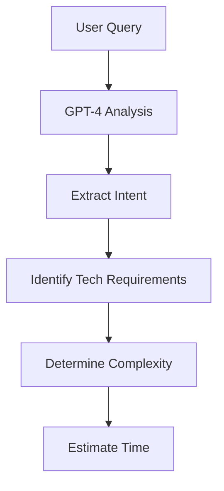

# AI-Powered Recommendation System Setup Guide

## Overview

This system transforms your generic tech resource database into an intelligent, context-aware recommendation engine that analyzes user project ideas and suggests the perfect tech stack.

## 🚀 Key Features

### 1. **AI Intent Extraction**
- Uses GPT-4 to analyze user project descriptions
- Extracts technical requirements, complexity level, and time estimates
- Identifies primary and secondary goals

### 2. **Smart Resource Matching**
- Enhanced database schema with use cases and problem domains
- Relationship mapping between technologies
- Curated collections for common project types

### 3. **Contextual Recommendations**
- Resources organized by tech stack role (frontend, backend, AI, etc.)
- Relevance scoring based on project requirements
- Alternative suggestions and complementary tools

### 4. **Implementation Guidance**
- AI-generated step-by-step implementation plans
- Best practices and potential challenges
- Realistic time estimates

## 📋 Setup Instructions

### 1. **Database Migration**

Run the enhanced database schema:

```sql
-- Execute the database-enhanced-recommendations.sql file
psql -d your_database < database-enhanced-recommendations.sql
```

This adds:
- Enhanced resource metadata (use_cases, problem_domains, difficulty_level)
- Resource collections table
- Resource relationships table
- Intent mappings table
- Recommendation history for learning

### 2. **Environment Variables**

Add to your `.env.local`:

```env
# OpenAI API Key (required for AI analysis)
OPENAI_API_KEY=your_openai_api_key

# Supabase Service Role Key (required for admin operations)
SUPABASE_SERVICE_ROLE_KEY=your_service_role_key
```

### 3. **API Integration**

The recommendation API is available at:
```
POST /api/recommendations
{
  "query": "I want to build an app that can clone UI from other websites",
  "includeGuidance": true
}
```

### 4. **Frontend Component**

Use the `AIPoweredSearch` component:

```tsx
import AIPoweredSearch from '@/components/ai-powered-search';

export default function MyPage() {
  return <AIPoweredSearch />;
}
```

## 🎯 Example Use Cases

### UI Cloning App
**User Input:** "I want to build an app that can clone UI from other websites"

**AI Analysis:**
- Primary Intent: `ui-cloning`
- Tech Requirements: Frontend (React, Tailwind), Tools (Puppeteer)
- Complexity: `intermediate`
- Time: `4-6 hours`

**Recommendations:**
- **Curated Collection:** "UI Cloning Toolkit"
- **Frontend:** shadcn/ui, Tailwind CSS, React
- **Tools:** Puppeteer, Playwright
- **Deployment:** Vercel, Netlify

### AI Chatbot
**User Input:** "Create an AI chatbot for customer support"

**AI Analysis:**
- Primary Intent: `ai-chatbot`
- Tech Requirements: AI (OpenAI), Frontend (React), Backend (Node.js)
- Complexity: `beginner`
- Time: `2-4 hours`

**Recommendations:**
- **Curated Collection:** "AI Chatbot Starter Pack"
- **AI:** Vercel AI SDK, OpenAI Node, LangChain
- **Frontend:** shadcn/ui, Next.js
- **Backend:** Supabase, Prisma

## 🧠 How It Works

### 1. **Intent Extraction Process**



### 2. **Resource Matching Algorithm**

```typescript
// Relevance Scoring
const score = 
  (primaryIntentMatch * 10) +
  (secondaryIntentMatch * 5) +
  (keywordMatches * 3) +
  (difficultyMatch * 2)
```

### 3. **Recommendation Categories**

1. **Curated Collections** - Pre-built stacks for common use cases
2. **Resources by Category** - Organized by tech stack role
3. **Top Matches** - Highest relevance scores
4. **Implementation Guidance** - AI-generated how-to guide

## 🔧 Customization

### Adding New Use Cases

1. **Create Collection:**
```sql
INSERT INTO resource_collections (name, description, use_case, difficulty_level, estimated_time, tags, resource_ids) VALUES
('Your Collection', 'Description', 'your-use-case', 'intermediate', '1-2 days', ARRAY['tag1', 'tag2'], ARRAY[resource_ids]);
```

2. **Update Resource Metadata:**
```sql
UPDATE resources SET 
  use_cases = ARRAY['your-use-case'],
  problem_domains = ARRAY['domain1', 'domain2'],
  difficulty_level = 'intermediate',
  tech_stack_role = 'frontend'
WHERE name = 'Your Resource';
```

### Adding Resource Relationships

```sql
INSERT INTO resource_relationships (resource_a, resource_b, relationship_type, strength, context) VALUES
(resource_a_id, resource_b_id, 'works_with', 0.9, 'Perfect combination for modern development');
```

## 📊 Analytics & Learning

The system tracks:
- User queries and intents
- Recommended resources
- User feedback (when implemented)
- Success scores

This data can be used to:
- Improve recommendation accuracy
- Identify popular use cases
- Optimize resource metadata

## 🚨 Important Notes

### Rate Limits
- OpenAI API calls are made for each query
- Consider implementing caching for similar queries
- Monitor API usage and costs

### Performance
- Database queries are optimized with indexes
- Consider implementing Redis caching for frequent queries
- Use pagination for large result sets

### Security
- Service role key has admin privileges
- Validate and sanitize user inputs
- Implement rate limiting on the API endpoint

## 🎉 Next Steps

1. **Enhanced Feedback Loop:**
   - Add user rating system
   - Track implementation success
   - Machine learning for better recommendations

2. **Advanced Features:**
   - Voice input support
   - Project templates generation
   - Cost estimation
   - Team collaboration features

3. **Integration Opportunities:**
   - GitHub repository creation
   - Automated project scaffolding
   - CI/CD pipeline setup
   - Deployment automation

## 📞 Support

If you encounter issues:
1. Check database connections and API keys
2. Verify resource metadata is properly populated
3. Monitor API response times and error rates
4. Review recommendation accuracy and user feedback

This system transforms your app from a simple resource directory into an intelligent development assistant that truly helps users "build fast" by understanding their specific needs and providing contextual, actionable recommendations. 